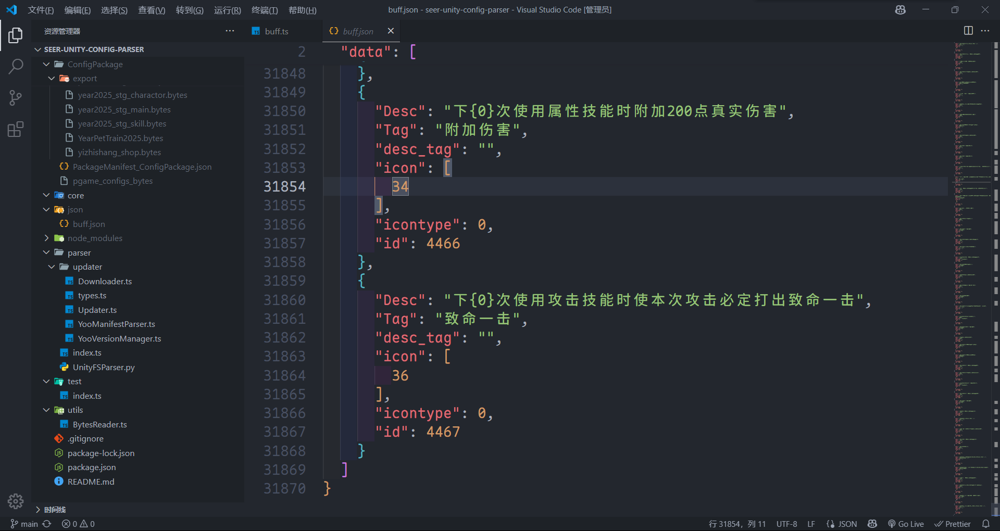

# seer-unity-config-parser

赛尔号 Unity 配置包的简易解析器，用于从 Unity 资源包中提取和解析配置数据。

Made with ❤️ by HurryWang(聿聿)

只用ai解析了几个常用的  数据解析就靠各位喽~~ 纯体力活...

算是抛砖引玉了，代码质量一般，不过还是希望大家点个star😭

## 功能特性

- 🔄 自动更新配置包版本
- 📦 Unity 资源包解析（使用 Python UnityPy）
- 🔧 二进制配置文件解析
- 🚀 高并发下载和处理

## 提取结果

<div align="center">
  
</div>

## 项目结构

```
├── bytes2json/          # 二进制转JSON解析器
│   └── buff.ts         # buff配置解析器
├── parser/             # 核心解析器
│   ├── updater/        # 更新器模块
│   ├── index.ts        # 主入口
│   └── UnityFSParser.py # Unity资源包解析器
├── utils/              # 工具类
│   └── BytesReader.ts  # 二进制数据读取器
└── test/               # 测试文件
    └── index.ts        # 测试示例
```

## 快速开始

### 安装依赖

```bash
npm install

pip install UnityPy
```

### 运行完整流程

```bash
npm start
```

这将执行：

1. 更新配置包
2. 解析 Unity 资源包
3. 转换为 JSON 格式

### 分步执行

```bash
# 1. 更新配置包
npm run update

# 2. 解析Unity资源包
npm run export

# 3. 测试转换
npm run test
```

## 使用示例

### 解析 buff 配置

```typescript
import { readFileSync } from "fs";
import { parseBuffConfig } from "./bytes2json/buff";

// 读取二进制配置文件
const fileBuffer = readFileSync("./ConfigPackage/export/buff.bytes");
const data = new Uint8Array(fileBuffer);

// 解析配置
const buffConfig = parseBuffConfig(data);
console.log(buffConfig);
```

### 自定义配置解析器

参考 `bytes2json/buff.ts` 的实现模式：

```typescript
import { BytesReader, LengthType } from "../utils/BytesReader";

interface MyConfig {
  // 定义你的配置结构
}

export function parseMyConfig(data: Uint8Array): MyConfig {
  const reader = new BytesReader(data, {
    lengthType: LengthType.Uint16,
    littleEndian: true,
  });

  // 实现解析逻辑
  return {};
}
```

## API 文档

### BytesReader

二进制数据读取器，支持多种数据类型：

- `boolean()` - 读取布尔值
- `byte()` - 读取字节
- `short()` / `ushort()` - 读取短整型
- `int()` / `uint()` - 读取整型
- `long()` / `ulong()` - 读取长整型
- `float()` / `double()` - 读取浮点数
- `text()` - 读取文本（自动处理长度前缀）

### 更新器

支持自动检测和下载最新的配置包：

```typescript
import Updater from "./parser/updater/Updater";
import Downloader from "./parser/updater/Downloader";
import YooVersionManager from "./parser/updater/YooVersionManager";

const updater = new Updater(
  "config-name",
  "description",
  versionManager,
  downloader
);

await updater.update();
```

## 配置说明

### 下载器配置

在 `parser/index.ts` 中可以配置请求头：

```typescript
const downloader = new Downloader({
  headers: {
    "user-agent": "your-user-agent",
    referer: "your-referer",
  },
});
```

### 版本管理

支持本地版本缓存和远程版本比较，自动检测需要更新的文件。

## 依赖项

- **axios** - HTTP 客户端
- **cli-progress** - 进度条显示
- **p-queue** - 并发控制
- **UnityPy** - Unity 资源包解析（Python）

## 开发

### 添加新的配置解析器

1. 在 `bytes2json/` 目录下创建新的解析器文件
2. 实现解析函数，参考 `buff.ts` 的模式
3. 在 `test/index.ts` 中添加测试用例

### 调试

BytesReader 支持调试模式，可以追踪读取过程：

```typescript
const reader = new BytesReader(data, options, "debug-tag");
```

## 贡献

欢迎提交 Issue 和 Pull Request 来完善项目！

## 许可证

ISC License
